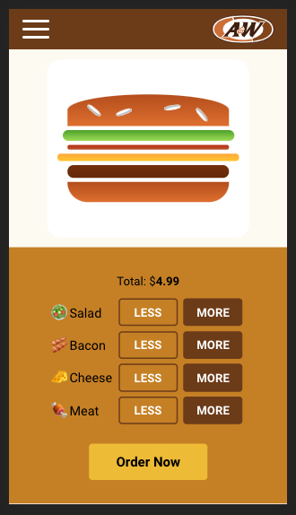
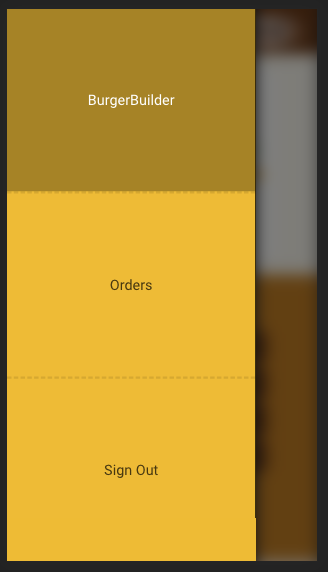
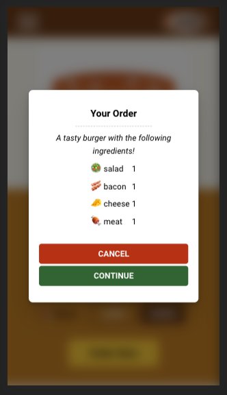
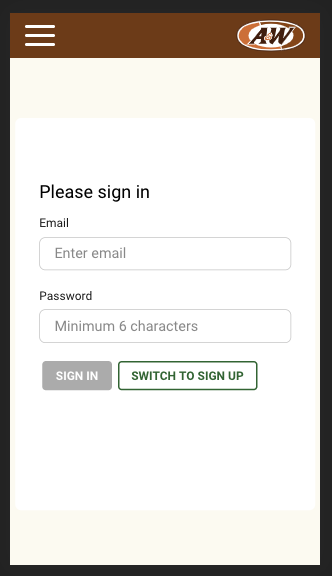
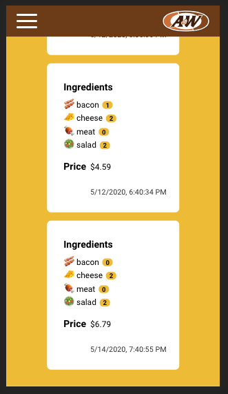

# React BurgerBuilder 6

### Screenshots

<table>
<tr>
<td></td>
<td></td>
<td></td>
</tr>
<tr>
<td></td>
<td></td>
<td></td>
</tr>
</table>

## New in this run

- Style-later approach with scss module
- No styled-component
  - Slower reloading for dev
  - Perf hit
  - Nested Component
  - Bloated Component File
  - Styling while developing interferes with workflow
  - Can use sass features (mixins, variables, functions)
- But for now, use both:
  - Because for now, the primary focus being learning stacks/ toolkit, it is better to keep using both to maintain the experience.
  - Use `Sass` for the components higher up in the tree.
    - styling is mostly for layouts
    - minimal dynamic styling based on state/props
    - no nested component for better debugging central logic
    - still usually nested inside Redux connect
  - Use `styled-components` for the UI components
    - usually at the lower side of the tree
    - need to add/remove classes based on user-generated events.
    - can use styled-component's theme provider
- Container + Component in one file
  - named export Component
  - default export Container
    - use utility function to update displayName
- [Redux Ducks snippet](https://gist.github.com/toypiano/5422dc229235b515e5b7f3763198fe5d)
- `useHistory` & `useRouteMatch` with `<Route>`
  - can use history object from children component inside `<Route>`
  - If you are using hooks, use `useHistory` instead of other Route render methods (component, render, children: Fn )
  - Route's `component={Component}` **creates new React element with `React.createElement()`** -> unmounts existing component and mount the new one (instead of updating it) 🤭💩🤷🏻‍♂️
    - That's why it takes Component instead of `<Component>`
  - Before hooks, you could avoid this behavior by using

```jsx
function FadingRoute({ component: Component, ...rest }) {
  return (
    <Route
      {...rest}
      render={(routeProps) => (
        <FadeIn>
          <Component {...routeProps} />
        </FadeIn>
      )}
    />
  );
}
```

or

```jsx
function ListItemLink({ to, ...rest }) {
  return (
    <Route
      path={to}
      children={({ match }) => (
        <li className={match ? 'active' : ''}>
          <Link to={to} {...rest} />
        </li>
      )}
    />
  );
}
```

## Try on next run

### Design first approach

- Good design makes it easier to understand & use UI
- This in turn, makes it easier and pleasant to work with business logic.
- Also components are more static, so you don't have to tinker with state to show components you want to style.
- Start with minimal Route setup. Navigate through typing path into address bar.
- Then finish styling components without functionality
- Then work on logic
  - event handlers
  - form input binding
  - form & input validation
  - authentication

## Components

### Modal

- Displays children in modal on top of a dark backdrop
- Closes when clicked on the backdrop

#### Props

- `show`: boolean - show backdrop when sliding in.
- `closeModal`: func - pass to backdrop. callback onClick.

#### Children

- Backdrop
  - takes separate `show` prop (positioned absolute)
- section element of props.children
  - translated out of screen when `show` is false

#### Animating Slide in/out

- Animating component should be there already (not conditionally rendered), but translated out of screen by default.
- Apply `.show` class conditionally with prop.

```css
.show {
  transform: translate(0);
}
```

### Spinner

Renders a spinner on top of a dark backdrop

Css spinner element is wrapped inside a positioning div

#### Props

- `show`

#### Can we have Spinner and Modal at the same time ?

No. If we do, then two Backdrops will overlap on top of each other making it twice as dark & opaque.

## Position fixed & absolute

Set top & left as well.

## Authentication with Email / Password

Higher level review

### User Story

- Users can sign up / sign in with email and password
- Upon success, users are redirected to the page they are supposed to be forwarded to (eg. root or checkout page)
- Upon failure, users can see a error message and stay on the page to re-try.
- Once authenticated, users can reload the page and still be logged in.
- Once authenticated, users can access authorized page links in the navbar (eg. orders, signout)
- In the orders page, only the orders made by the currently logged-in user are displayed.
- Users are logged out automatically when the token received from initial log-in expires.
- While logged in, some fields in the order form are pre-filled with the user information (eg. email).
- Page paths are guarded against un-authorized users. (un-authorized users cannot go to pages by typing into the address bar)

#### States

- isAuthenticated? - you can get this from `idToken !== null` check
- expirationDate? - you can only save this to the localStorage and use it when the user reloads the page to check auth status. If you need to check expirationDate in other components, you can store it in state.
- idToken - access token that expires after certain time
- localId - id of the user
- error
- authRedirectPath - set redirection path after login/signUp based on state in other components

### Implementations

#### Redirection

- Redirect users to checkout if burger is touched or visited auth from clicking 'log in to order' button on BurgerBuilder page.
- In `orderNow` function @BurgerBuilder

### Caveats

### Related Components in Application

- `NavItems` - renders a list of NavItem's based on `isAuthenticated`
- BurgerBuilder > BuildControls > `OrderButton` - Display "Sign In to ORder" when not authenticated. Display "Order Now" when it is.

## Action Creators vs Thunk Creators

- Return action object from action creators

```js
export const clearLogoutTimeout = () => {
  clearTimeout(timeoutId);
  // you will dispatch this action somewhere
  return { type: LOGOUT_TIMEOUT_CLEAR };
};
```

- Dispatch action creators | thunk creators from thunk

If you return an action inside a thunk just like you do in action creators:

```js
// Thunk creator
export const setLogoutTimeout = (remainingTime) => {
  // Thunk
  return function setLogoutTimeoutThunk(dispatch) {
    // Use thunk when you need to dispatch another action | thunk creators
    timeoutId = setTimeout(() => dispatch(logOut()), remainingTime);
    // this will not do anything
    return setLogoutTimeout();
  };
};
```

You have to "dispatch" actions inside a thunk

```js
export const setLogoutTimeout = (remainingTime) => {
  console.log(remainingTime);
  return function setLogoutTimeoutThunk(dispatch) {
    // logOut is a thunk creator
    timeoutId = setTimeout(() => dispatch(logOut()), remainingTime);
    // middleware only runs the thunk. It doesn't dispatch the returned value
    dispatch({ type: LOGOUT_TIMEOUT_SET });
  };
};
```

## Async Thunk - return Promise

Return `Promise.reject()` from the catch block inside async thunk in order to chain the result in the component that dispatches the thunk creator.

### Example

You want to run mapped dispatch 'auth' inside a submit handler and take down the spinner if the dispatched thunk catches an error.

```js
const handleFormSubmit = async (e) => {
  e.preventDefault();
  setIsLoading(true);
  try {
    await auth(authForm.email.value, authForm.password.value, isSignIn);
    // when authenticated, redirect happens and Auth unmounts
    // so no need to setIsLoading on unmounted component
  } catch (err) {
    // only turn off spinner when auth throws error
    setIsLoading(false);
  }
};
```

But if you don't return Promise from the thunk, the promise is settled within the thunk's catch block. So the error is never passed to the catch block inside the submit handler.

```js
export const auth = (email, password, isSignIn) => {
  return async function authThunk(dispatch) {
    // do some prep
    // ...
    try {
      const response = await axios.post(uri, payload);
      console.log(response);

      // store user info & remaining time to token expiration into the localStorage
      // ...
      dispatch(setLogoutTimeout(remainingTime));
      dispatch(authSuccess(response.data));
    } catch (err) {
      dispatch(authFail(err));
      // no Promise returned. done(settled).
    }
  };
};
```

Return a rejected Promise so that it can be further chained inside another catch block.

```js
} catch (err) {
      dispatch(authFail(err));
      return Promise.reject(err);
    }
```

## `backdrop-filter`

Apply android-like backdrop

```css
.Backdrop {
  /* ... */
  background: rgba(0, 0, 0, 0.5);
  backdrop-filter: blur(10px);
  /* ... */
}
```

## Reducer switch statement inside Immer draft updater

Place state statement inside updater function to call produce only once.

```js
export default function ordersReducer(state = initialState, action) {
  return produce(state, (draft) => {
    switch (action.type) {
      case POST_ORDER_SUCCESS:
        draft.error = null;
        return;
      case POST_ORDER_FAIL:
        draft.error = action.error;
        return;
      case GET_ORDERS_SUCCESS: {
        const orders = Object.entries(action.orders).map(([id, order]) => ({
          id,
          ...order,
        }));
        draft.orders = orders;
        draft.error = null;
        return;
      }
      case GET_ORDERS_FAIL:
        draft.error = action.error;
        return;
      default:
        return;
    }
  });
}
```

## CSS @keyframes is not scoped

CSS animation name you define with `@keyframe` isn't scoped within a component with styled-component.  
You can use `keyframes` helper to scope animation per component.

```jsx
// Create the keyframes
const rotate = keyframes`
  from {
    transform: rotate(0deg);
  }
  to {
    transform: rotate(360deg);
  }
`;
// Here we create a component that will rotate everything we pass in over two seconds
const Rotate = styled.div`
  display: inline-block;
  animation: ${rotate} 2s linear infinite;
  padding: 2rem 1rem;
  font-size: 1.2rem;
`;
render(<Rotate>&lt; 💅 &gt;</Rotate>);
```

## Guarding routes with React Router

Place authorized `<Routes />` inside `<Switch />` component and add a default route at the end with `<Redirect />` component.

Return only authorized routes

```jsx
const routes = (
  <Switch>
    <Route path="/" exact>
      <BurgerBuilder />
    </Route>
    <Route path="/auth">
      <Auth />
    </Route>
    <Redirect to="/" />
  </Switch>
);

const authenticatedRoutes = (
  <Switch>
    <Route path="/" exact>
      <BurgerBuilder />
    </Route>
    <Route path="/checkout">
      <Checkout match={match} />
    </Route>
    <Route path="/orders">
      <Orders />
    </Route>
    <Route path="/signout">
      <SignOut />
    </Route>
    <Redirect to="/" />
  </Switch>
);

return (
  <div className="App">
    <Layout>{isAuthenticated ? authenticatedRoutes : routes}</Layout>
  </div>
);
```
